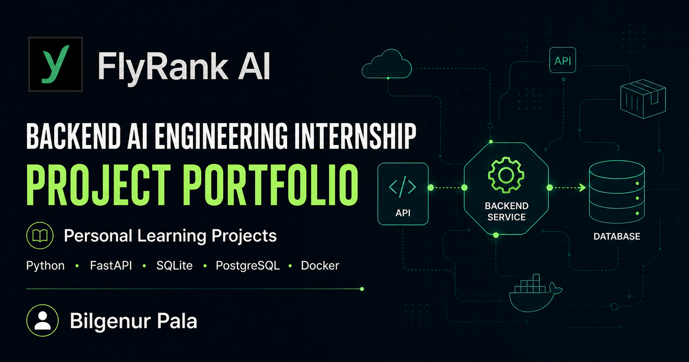
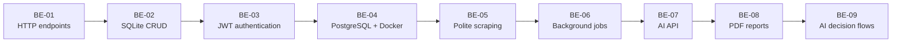

# FlyRank AI - Backend AI Engineering Internship



An evolving portfolio of backend engineering assignments completed during my part-time Backend AI Engineering internship at [FlyRank AI](https://flyrank.ai/). The repository documents my progression from a first HTTP endpoint to persistent storage, authentication, layered architecture, PostgreSQL, and containerized services.

> This repository contains only my personal learning work. It does not contain FlyRank proprietary systems, credentials, or client code.

## Portfolio at a Glance

| Project | Focus | Core Technologies | Evidence |
|---|---|---|---|
| [BE-01 - First API Endpoint](backend-engineering/be-01) | HTTP and API fundamentals | Python, FastAPI, Uvicorn | Three working JSON endpoints |
| [BE-02 - Database-Backed CRUD](backend-engineering/be-02) | Persistence and SQL | FastAPI, SQLite, Pytest | Full CRUD, restart persistence, database view |
| [BE-03 - Auth: Login and Protect](backend-engineering/be-03) | Authentication and route security | Supabase Auth, JWT, HTTPBearer | Protected routes, 10 tests, Swagger locks |
| [BE-04 - Containerized Stack](backend-engineering/be-04) | Architecture and infrastructure | PostgreSQL, Docker Compose, psycopg | Layered service and persistent named volume |
| [BE-05 - The Polite Scraper](backend-engineering/be-05) | Ethical data collection | Python, robots.txt, JSON, Pytest | Rate limiting, bounded backoff, 20-record live output, 5 tests |
| [BE-06 - Your First Background Job](backend-engineering/be-06) | Asynchronous work and state | FastAPI, SQLite, thread pool, Pytest | Queryable lifecycle, persisted metadata, 3 tests |
| [BE-07 - Connect to an AI API](backend-engineering/be-07) | AI integration | FastAPI, Gemini, HTTPX, Pydantic | Structured output, bounded retries, timeout and response validation, 8 tests |
| [BE-08 - PDF Report Generator](backend-engineering/be-08) | Reporting pipeline | FastAPI, SQLite, ReportLab, background jobs | SQL aggregation, stored PDF, queryable job lifecycle, 4 tests |
| [BE-09 - AI Decision Flow](backend-engineering/be-09) | Visual AI workflow execution | Next.js, React Flow, Inngest, OpenAI | Editable YES/NO graph, durable node steps, execution path and logs, 4 tests |
| [AI Fluency](ai-fluency) | Prompting, workflow automation, agent design, and portfolio communication | Claude, ChatGPT, GitHub tools, Markdown | FL-01–FL-10, the [SB-08 decision-layer explainer](ai-fluency/explain-it-like-you-built-it), and PF-04 artifacts connected to the [live portfolio](https://bilgenurpala.netlify.app/) |
| [SafeBump](https://github.com/bilgenurpala/safebump) | Guarded dependency-upgrade agent | Python, pip, Pytest, Git | Working decision loop, five executed evals, Markdown reports, rollback and approval evidence |

## Engineering Progression



Each project adds one production-oriented backend concern while keeping API contracts explicit and testable.

## Skills Demonstrated

| Area | Practices |
|---|---|
| API development | REST-style routes, JSON contracts, validation, HTTP status codes, Swagger UI |
| Data | Parameterized SQL, schema initialization, seed data, SQLite, PostgreSQL, persistence |
| Security | Environment-based secrets, Supabase Auth, verified JWTs, reusable bearer protection |
| Architecture | Route/service/repository separation, dependency injection, interchangeable storage |
| Quality | Automated endpoint tests, clean-clone setup, checkpoint-driven Git history |
| Operations | Docker images, Compose orchestration, health checks, environment templates, volumes |

## Repository Map

```text
flyrank-internship/
├── backend-engineering/
│   ├── be-01/    First FastAPI endpoints
│   ├── be-02/    SQLite-backed task CRUD API
│   ├── be-03/    Supabase authentication and protected routes
│   ├── be-04/    PostgreSQL service orchestrated with Docker Compose
│   ├── be-05/    Robots-aware catalogue scraper
│   ├── be-06/    SQLite-backed background job API
│   ├── be-07/    Validated AI API integration
│   ├── be-08/    On-demand PDF report pipeline
│   └── be-09/    React Flow and Inngest AI decision workflow
├── ai-fluency/   AI Fluency assignments organized as fl-XX
└── assets/       Portfolio visuals
```

Every project is self-contained and has its own README with architecture, setup instructions, API reference, verification steps, and learning outcomes.

## Capstone Agent

[SafeBump](https://github.com/bilgenurpala/safebump) is the internship capstone agent. It is designed to inspect pinned Python dependencies, attempt eligible upgrades one package at a time, verify them with the target project's tests and `pip check`, and keep or roll back each local change under explicit guardrails. The separate repository prevents the agent's future branch and rollback operations from moving this internship repository underneath its own source.

The design specification and five measurable evaluation cases were published before implementation. The implemented agent passed all five cases: safe patch keep, test-driven rollback with a concrete error, major-version approval, rollback on a real `pip check` conflict despite green tests, and an unapproved push that produced no remote mutation. SafeBump reuses a disclosed copy of BE-02 as its controlled target; it does not present that backend as new capstone work.

## Program Themes

- **API contracts** - designing predictable endpoints and JSON responses
- **Data and persistence** - moving state from memory to durable databases
- **Authentication and authorization** - identifying callers before granting access
- **Production architecture** - separating concerns and swapping infrastructure cleanly
- **Evaluation and operations** - testing behavior and running reproducible environments

## Weekly Progress

| Week | Assignment | Status |
|---:|---|:---:|
| 1 | [BE-01 - Build Your First API Endpoint](backend-engineering/be-01) | Complete |
| 2 | [BE-04 - Containerize Your Stack](backend-engineering/be-04) | Complete |
| 3 | [BE-02 - Connect CRUD to the Database](backend-engineering/be-02) | Complete |
| 4 | [BE-03 - Auth: Login and Protect](backend-engineering/be-03) | Complete |
| 5 | Ship the Ugly One and PF-04 live portfolio | Complete |
| 6 | Explain It Like You Built It and BE-06 background jobs | Complete |
| 7 | Open It on Your Phone and Survive the Crit | Submitted; review pending |
| 8 | Make It Do Something | Complete; production submission verified |
| 9 | [BE-09 - Build an AI Decision Flow with React Flow + Inngest](backend-engineering/be-09) | Implemented; portal submission pending |

## Running a Project

Open the README inside the project you want to run. Python projects use an isolated virtual environment and a project-local `requirements.txt`; BE-04 can run the complete API and database stack with Docker Compose.

## Related Learning Repositories

- [Anthropic Academy](https://github.com/bilgenurpala/anthropic-academy) - certification coursework assigned during the internship
- [AI Learning Lab](https://github.com/bilgenurpala/ai-learning-lab) - central repository for AI engineering experiments and notes

## Author

**Bilgenur Pala**<br>
Backend AI Engineering Intern
