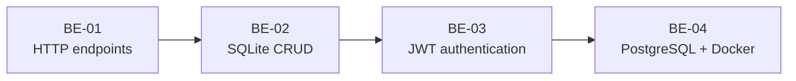

# FlyRank AI - Backend AI Engineering Internship


An evolving portfolio of backend engineering assignments completed during my part-time Backend AI Engineering internship at [FlyRank AI](https://flyrank.ai/). The repository documents my progression from a first HTTP endpoint to persistent storage, authentication, layered architecture, PostgreSQL, and containerized services.

> This repository contains only my personal learning work. It does not contain FlyRank proprietary systems, credentials, or client code.

## Portfolio at a Glance

| Project | Focus | Core Technologies | Evidence |
|---|---|---|---|
| [BE-01 - First API Endpoint](be-01) | HTTP and API fundamentals | Python, FastAPI, Uvicorn | Three working JSON endpoints |
| [BE-02 - Database-Backed CRUD](be-02) | Persistence and SQL | FastAPI, SQLite, Pytest | Full CRUD, restart persistence, database view |
| [BE-03 - Auth: Login and Protect](be-03) | Authentication and route security | Supabase Auth, JWT, HTTPBearer | Protected routes, 10 tests, Swagger locks |
| [BE-04 - Containerized Stack](be-04) | Architecture and infrastructure | PostgreSQL, Docker Compose, psycopg | Layered service and persistent named volume |

## Engineering Progression



Each project adds one production-oriented backend concern while keeping API contracts explicit and testable.

## Skills Demonstrated

| Area | Practices |
|---|---|
| API development | REST-style routes, JSON contracts, validation, HTTP status codes, Swagger UI |
| Data | Parameterized SQL, schema initialization, seed data, SQLite, PostgreSQL, persistence |
| Security | Environment-based secrets, Supabase Auth, verified JWTs, reusable bearer protection |
| Architecture | Route/service/repository separation, dependency injection, interchangeable storage |
| Quality | Automated endpoint tests, clean-clone setup, checkpoint-driven Git history |
| Operations | Docker images, Compose orchestration, health checks, environment templates, volumes |

## Repository Map

```text
flyrank-internship/
├── be-01/    First FastAPI endpoints
├── be-02/    SQLite-backed task CRUD API
├── be-03/    Supabase authentication and protected routes
├── be-04/    PostgreSQL service orchestrated with Docker Compose
└── assets/   Portfolio visuals
```

Every project is self-contained and has its own README with architecture, setup instructions, API reference, verification steps, and learning outcomes.

## Program Themes

- **API contracts** - designing predictable endpoints and JSON responses
- **Data and persistence** - moving state from memory to durable databases
- **Authentication and authorization** - identifying callers before granting access
- **Production architecture** - separating concerns and swapping infrastructure cleanly
- **Evaluation and operations** - testing behavior and running reproducible environments

## Weekly Progress

| Week | Assignment | Status |
|---:|---|:---:|
| 1 | [BE-01 - Build Your First API Endpoint](be-01) | Complete |
| 2 | [BE-04 - Containerize Your Stack](be-04) | Complete |
| 3 | [BE-02 - Connect CRUD to the Database](be-02) | Complete |
| 4 | [BE-03 - Auth: Login and Protect](be-03) | Complete |
| 5 | Upcoming assignment | Planned |
| 6 | Upcoming assignment | Planned |
| 7 | Upcoming assignment | Planned |
| 8 | Upcoming assignment | Planned |

## Running a Project

Open the README inside the project you want to run. Python projects use an isolated virtual environment and a project-local `requirements.txt`; BE-04 can run the complete API and database stack with Docker Compose.

## Related Learning Repositories

- [Anthropic Academy](https://github.com/bilgenurpala/anthropic-academy) - certification coursework assigned during the internship
- [AI Learning Lab](https://github.com/bilgenurpala/ai-learning-lab) - central repository for AI engineering experiments and notes

## Author

**Bilgenur Pala**<br>
Backend AI Engineering Intern
