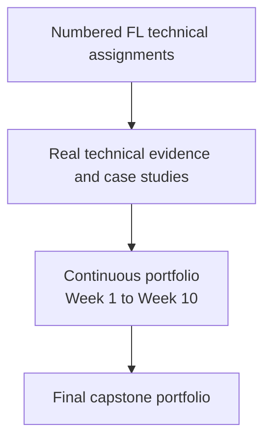

# FlyRank AI Fluency - Detailed Weekly Guide

## Purpose of This Document

This guide consolidates the AI Fluency Week pages, assignment screenshots, deliverables, and evaluation criteria shared for the FlyRank internship. The original program concepts and assignment names are preserved. The explanations below organize and clarify the work without renaming its terminology.

Official program sources:

- [AI Fluency home](https://aifluency.flyrank.ai/)
- [All assignments](https://aifluency.flyrank.ai/assignments)
- [Week 1](https://aifluency.flyrank.ai/week-01.html)
- [Week 2](https://aifluency.flyrank.ai/week-02.html)
- [Week 3](https://aifluency.flyrank.ai/week-03.html)
- [Week 4](https://aifluency.flyrank.ai/week-04.html)
- [Week 5](https://aifluency.flyrank.ai/week-05.html)
- [Week 6](https://aifluency.flyrank.ai/week-06.html)
- [Week 7](https://aifluency.flyrank.ai/week-07.html)
- [Week 8](https://aifluency.flyrank.ai/week-08.html)
- [Week 9](https://aifluency.flyrank.ai/week-09.html)
- [Week 10](https://aifluency.flyrank.ai/week-10.html)

## What the Ten-Week Track Builds

The Week assignments form one continuous project: a personal portfolio that proves one specific capability to one specific audience and moves that person toward one action. It is not a collection of unrelated weekly websites and it is not a copy of a LinkedIn profile.

The portfolio starts as a focused claim, becomes a content and design plan, goes live early, gains one real feature, passes two checkpoints, and ends as a capstone on a public domain.

```mermaid
flowchart LR
    W1["Week 1<br/>Define the proof"] --> W2["Week 2<br/>Frame real work"]
    W2 --> W3["Week 3<br/>Map content and identity"]
    W3 --> W4["Week 4<br/>Choose stack and go live"]
    W4 --> W5["Week 5<br/>Ship the ugly version"]
    W5 --> W6["Week 6<br/>Explain the build"]
    W6 --> W7["Week 7<br/>Mobile QA and Design Review"]
    W7 --> W8["Week 8<br/>Wire one real feature"]
    W8 --> W9["Week 9<br/>Hardening and launch"]
    W9 --> W10["Week 10<br/>Demo and story"]
```

## The Persistent AI Workspace

An **AI workspace** is created in Week 1 and retained throughout the full track. It can be a Project in Claude or ChatGPT, a Gem in Gemini, or a reusable context document when the chosen tool has no workspace feature.

The same workspace accumulates:

- proof statement
- one-line claim
- one person and one action
- sitemap and content map
- voice card
- framed cases
- identity kit
- final image decisions
- stack decision
- live-site context
- review feedback and fix logs
- known limitations
- plan to keep building

AI acts as interviewer, tutor, critic, build partner, and auditor. The intern remains the human in the loop: choosing, verifying, understanding, and owning the result.

## Program Vocabulary

The following terms should remain consistent across deliverables.

| Concept | Program meaning |
|---|---|
| **Proof statement** | One paragraph naming the one claim, one person, and one action. |
| **One claim** | The single primary capability the portfolio must prove. |
| **One person / audience** | The specific person who must believe the claim, not a general group such as “everyone.” |
| **One action** | The single most important action the visitor should take. |
| **Call to action (CTA)** | The visible invitation that leads toward the one action. |
| **Sitemap** | The small set of pages and the route from landing to proof to action. |
| **Voice card** | Five to seven words that define how the writing should sound. |
| **Case study** | A real piece of work framed so a stranger understands why it matters. |
| **The three beats** | The problem, what you did and decided, and what came of it. |
| **One-line claim** | The single sentence a visitor should remember. |
| **Content map** | Ordered page sections, cases, CTAs, and missing evidence. |
| **Visual identity** | The consistent type, palette, logo/favicon, spacing, and mood choices. |
| **Identity kit** | The one-page record of fonts, hex codes, logo/favicon, and style note. |
| **Palette** | Main color, near-black, near-white, and at most one accent. |
| **Hex code** | The exact code used to preserve a color consistently. |
| **Favicon** | The small icon displayed in the browser tab. |
| **Contrast** | How clearly text and interface elements stand out from their background. |
| **AI slop** | Generic generated imagery that does not serve the work or share a coherent style. |
| **Stack** | The tools used to build, host, and run the portfolio. |
| **Backend** | The part that remembers or performs something a static page cannot. |
| **Deploy / publish** | Making the latest version reachable at a public URL. |
| **Ship the ugly version** | Publishing a complete but visibly unfinished version instead of waiting for perfection. |
| **Tutor mode** | Asking AI to teach, explain, quiz, and correct rather than merely provide an answer. |
| **Mystery code** | Code added without enough understanding to begin explaining it. |
| **Human in the loop** | The person directs, judges, verifies, and owns the AI-assisted result. |
| **Responsive / mobile-first** | Designing and testing for a real phone before treating desktop as the only target. |
| **Design review (crit)** | Structured feedback on whether the site communicates and works. |
| **Must-fix vs nice-to-have** | A decision separating blocking feedback from improvements that can wait. |
| **Checkpoint** | A required review gate that must pass before later work proceeds. |
| **Data flow** | The path data follows from user input to the final destination or result. |
| **Edge case** | An unusual or invalid interaction that may expose a failure. |
| **Known limitation** | A weakness deliberately documented rather than hidden. |
| **SEO / meta** | Page information that supports search discovery and link presentation. |
| **Share preview** | The preview card shown when a URL is shared. |
| **Custom domain** | A personal public web address connected to the portfolio. |
| **HTTPS** | Secure delivery of the site over an encrypted connection. |
| **Analytics** | Visitor measurement used to confirm that real people reach the site. |
| **Build-in-public** | Sharing the honest story of the work, including a real win and limitation. |
| **Capstone** | The launched portfolio, working feature, demo, write-up, and launch story. |

---

# Week 1 - Decide What You're Proving

## Theme

**AI n-able Yourself**

Phase: **Setup**

Week 1 makes the decision that controls the entire portfolio: what it proves, who must believe it, and what that person should do next. AI is used to interview and challenge the intern, not to invent a generic identity.

## Assignment: What Are You Proving?

### Required work

1. Write a one-paragraph **proof statement**.
2. Name one primary **claim** rather than combining several skills.
3. Name one specific **person** who could hire or engage you.
4. Choose one **action** that matters most.
5. Use AI as a thinking partner in a narrowing interview.
6. Add one honest line explaining what a CV or LinkedIn alone cannot prove.

### Deliverable

- one-paragraph proof statement
- one-line explanation of why the portfolio needs to exist

### Pass / revise

- Exactly one primary claim is visible.
- The audience is a specific decision-maker, not “everyone.”
- There is one most-important action.
- The statement is specific enough that it could only describe the intern's actual direction and evidence.

## Assignment: Draw the Path: Portfolio Sitemap + Toolkit

### Required work

1. Create a small **sitemap** that leads the one person from landing, to believing, to taking the one action.
2. Keep only pages that earn their place against the claim and action.
3. Choose a primary AI chat tool and prepare alternatives for comparison.
4. Create the persistent **AI workspace** for the portfolio.
5. Add genuine custom instructions, including identity, proof statement, and tutor behavior.
6. Run a real sitemap pressure-test prompt.
7. Save the response and record at least one resulting change.

### Deliverable

- sitemap sketch or image
- configured AI workspace screenshot
- pressure-test prompt and output
- at least one documented sitemap change

### Pass / revise

- The sitemap is intentionally small.
- Every page supports the claim or one action.
- Custom instructions are real and specific, not defaults.
- The workspace contains the proof statement.
- The pressure test caused a documented decision or change.

## Week 1 dependency

Every later Week reuses the proof statement, one person, one action, sitemap, and AI workspace. A vague Week 1 creates vague case studies, design, copy, and review criteria later.

---

# Week 2 - Frame Your Work

## Theme

**Make the Work Speak**

Phase: **Foundations**

Week 2 turns real work into evidence. A screenshot or repository link alone does not explain the problem, decisions, or result. AI interviews the intern one question at a time so the story comes from real experience.

## Assignment: Frame It as Cases: Work That Speaks for Itself

### Required work

1. Create a **voice card** with five to seven words.
2. Add the voice card to the AI workspace as a standing instruction.
3. Select every real project required by the Week 1 sitemap.
4. For each project, let AI conduct a one-question-at-a-time interview.
5. Extract the problem, personal decisions, attempts that failed, outcome, and possible next improvement.
6. Shape each project using **the three beats**:
   - the problem
   - what you did and decided
   - what came of it
7. Draft bio and contact/CTA copy using the same voice.
8. Read the copy aloud and remove lines that are generic, inflated, or not defensible.
9. Preserve one before/after example showing generic AI copy beside the edited human version.

### Deliverable

- voice card
- framed case for each piece required by the sitemap
- bio and CTA copy
- one generic-AI versus edited-human before/after

### Pass / revise

- Every required project is a framed case, not a bare title or screenshot.
- Each case contains the three beats.
- The details could only describe the actual project.
- The writing follows the voice card.
- The cases speak to the one person and support the one action.
- Results remain honest, even when small or incomplete.

## Week 2 dependency

The framed cases become the content used in Week 3's content map and the real work assembled into the live site in Week 5.

---

# Week 3 - Map It & Give It a Face

## Theme

**Consistency, Not Talent**

Phase: **Foundations**

Week 3 decides what appears where and gives the portfolio a restrained, consistent visual system. The design frames the work; it must not become more memorable than the evidence.

## Assignment: The Through-Line: Map Content & CTAs

### Required work

1. Write a memorable **one-line claim**.
2. Use AI to generate options, but make the final choice personally.
3. Create a **content map** for every page.
4. List page sections in order.
5. Decide which case appears on each page and lead with the strongest case.
6. Name the CTA on every page.
7. Ensure every CTA ladders toward the Week 1 one action.
8. Create a **still need to gather** list for screenshots, demo links, repositories, metrics, testimonials, or other proof.

### Deliverable

- one-line claim
- ordered content map
- named CTAs
- still need to gather list

### Pass / revise

- The claim is one memorable sentence, not a paragraph.
- Every page has ordered sections.
- Every CTA supports the one action.
- The strongest evidence leads.
- Missing proof is documented honestly.

## Assignment: Decide Once: Build Your Identity Kit

### Required work

1. Choose one or two free fonts.
2. Choose a tight **palette**: main color, near-black, near-white, and at most one accent.
3. Record exact **hex codes**.
4. Create a simple logo or **favicon**.
5. Write a two-line style note covering fonts, colors, and mood.
6. Add the **identity kit** to the AI workspace so future sections remain consistent.
7. Check text and accent **contrast**, including phone readability.

### Deliverable

- one-page identity kit
- named fonts
- palette with hex codes
- logo or favicon
- two-line style note

### Pass / revise

- No more than one or two fonts.
- The palette is approximately three or four controlled colors.
- The logo/favicon exists.
- The style note defines one coherent mood.
- The visual system frames the work rather than competing with it.

## Assignment: Kill Your Darlings: Curate Your Images

### Required work

1. List the exact images required by the content map.
2. Prefer real project screenshots, photos, or captures for evidence.
3. Crop and prepare captures so they are clean and legible.
4. Use generated imagery only for connective material where it genuinely helps.
5. Keep generated material in one consistent style and mood.
6. Use a real photo when the subject is the intern.
7. Reject weak or unnecessary options deliberately.
8. Write one or two lines explaining why at least one generated image was rejected.

### Deliverable

- final image set
- mapping between images and content needs
- rejection note

### Pass / revise

- Real work is represented by real captures rather than AI stand-ins.
- Generated images, if any, share a coherent visual system.
- A real person is represented by a real photo.
- The rejection note demonstrates discernment rather than preference alone.

## Week 3 dependency

The content map, identity kit, and curated images are loaded into the persistent AI workspace before the build begins. Week 4 uses these artifacts to choose an appropriate stack.

---

# Week 4 - Pick the Stack

## Theme

**Options, Not Decrees**

Phase: **Build**

Week 4 uses AI for decision support. The intern provides real constraints, requests three alternatives with trade-offs, pressure-tests the front-runner, and remains responsible for the final choice.

## Assignment: Three Roads: Choose Your Stack with AI

### Required work

1. Give AI four constraints:
   - free only
   - honest skill level
   - what the portfolio must do, using the sitemap and content map
   - how the work must be displayed
2. State whether anything must be dynamic at launch.
3. Request three stack options, from simplest to most powerful.
4. For each option, identify build approach, free host, backend requirement, display fit, maintenance burden, and trade-off.
5. Pressure-test the front-runner:
   - what breaks with the simplest option
   - what must be maintained with the most powerful option
   - whether it can be completed and understood
   - whether it presents the work correctly
6. Write the final rationale in the intern's own words.
7. Explain the chosen stack, the two rejected alternatives, and whether it can be maintained.

### Deliverable

- three considered stack options
- pressure-test notes
- written stack decision and rationale

### Pass / revise

- Three genuine alternatives were considered.
- Trade-offs are explicit.
- The chosen stack is free and matches the real portfolio requirements.
- The backend question is answered honestly.
- The rationale includes maintainability and is written in the intern's own words.

## Assignment: Empty but Live: Ship a Blank Page

### Required work

1. Create the empty project using the chosen stack.
2. Publish a near-blank page to a real public URL.
3. Ensure the root homepage is configured correctly for the host.
4. Open the URL on a second device, preferably a real phone.
5. Load the identity kit, case studies, and content map into the AI workspace for Week 5.

### Deliverable

- live URL of the empty or near-blank project
- screenshot proving it is reachable
- stack rationale

### Pass / revise

- The URL is public and works on a second device.
- The page matches the chosen stack.
- The project context is ready for the next build Week.

## Week 4 dependency

Week 5 fills the same live project. The Week 4 URL is not a disposable demo; it is the first deployed version of the continuing portfolio.

---

# Week 5 - Ship the Ugly Version

## Theme

**Ship Ugly, Ship Live**

Phase: **Build**

Week 5 assembles the previously decided content, design, and images. The goal is complete enough to understand, not polished. AI assists section by section; unexplained mystery code is not acceptable.

## Assignment: Ship the Ugly One

### Required work

1. Assemble the real cases, identity kit, and curated images into the live project.
2. Build page by page and section by section.
3. Ask AI to explain anything that is not understood before it is shipped.
4. Make every sitemap page reachable through working navigation.
5. Ensure every case opens and contains real content.
6. Send the live link to one real person, ideally in the target field.
7. Record what that person noticed, what confused them, and whether the intended proof landed.
8. Write an honest **still ugly** list.

### Deliverable

- public URL with all sitemap pages reachable
- note capturing one real person's reaction
- still ugly list

### Pass / revise

- The portfolio is actually live.
- All sitemap pages and cases are reachable.
- Real work replaces placeholder content.
- A real person opened the link and their response was recorded.
- The intern can begin to explain every shipped part.
- The still ugly list is honest and specific.

## Week 5 dependency

Week 6 selects one confusing or interesting part from this real build. Week 7 tests and reviews the same live URL.

---

# Week 6 - Explain Your Build

## Theme

**Explain It Like You Built It**

Phase: **Build+**

Week 6 protects the credibility line between building with AI and shipping something the intern cannot explain. It explicitly uses **tutor mode**.

## Assignment: Explain It Like You Built It

### Required work

1. Select one real part of the live build that was interesting or not fully understood.
2. Use the actual code or configuration rather than a generic tutorial topic.
3. Ask AI to teach that specific part.
4. Ask AI to quiz understanding and correct mistakes.
5. Write a short explanation in plain language and in the intern's own words.
6. Explain it as if teaching a friend who has never built a site.

### Deliverable

- short plain-words explanation of one real part of the build

### Pass / revise

- The subject is a real piece of the portfolio.
- The explanation is technically correct.
- It is written in the intern's own words.
- It demonstrates learning rather than pasted AI output.

## Week 6 dependency

The explanation demonstrates ownership before the portfolio enters the Week 7 Design Review.

---

# Week 7 - Make It Real

## Theme

**Make It Real - Checkpoint 1**

Phase: **Build+**

Week 7 is the first formal gate. The portfolio must work on real devices and communicate the intended proof before a dynamic feature is added.

## Assignment: Open It on Your Phone

### Required work

1. Open the public portfolio on a real phone.
2. Fix broken layout, overflowing or blurry images, small text, and untappable controls.
3. Check tablet and desktop widths after the phone.
4. Check text size, line spacing, and contrast.
5. Confirm work captures remain crisp.
6. Click every link, including demo and repository links.
7. Compress oversized images and investigate slow sections.
8. Use AI to audit mobile behavior, accessibility, speed, and obvious breaks.
9. Maintain a fix log recording what was broken and what changed.

### Deliverable

- updated live URL
- before/after fix log
- ideally, phone screenshots before and after

### Pass / revise

- The site was checked on a real phone, not only a resized browser.
- Text is readable and contrast is acceptable.
- Images are crisp and appropriately sized.
- Links work.
- Nothing is obviously broken at common widths.
- The fix log contains real findings and corrections.

## Assignment: Survive the Crit

### Required work

1. Submit the live portfolio and Week 1 proof statement for structured **Design Review**.
2. Ask the reviewer:
   - In ten seconds, what do I do?
   - Would you believe I am good at it?
3. Collect feedback without defending the original design.
4. Sort findings into **must-fix vs nice-to-have**.
5. Treat confusion, broken behavior, damage to the one action, and failed proof as must-fix.
6. Fix must-fixes on the live site.
7. Respond with what changed.

### Deliverable

- reviewer's feedback
- must-fix / nice-to-have classification
- evidence that must-fixes were corrected on the live site

### Pass / revise

- The reviewer could state the intended capability, or the resulting gap was fixed.
- Feedback is captured honestly.
- Must-fixes are corrected, not merely acknowledged.
- The intern engaged with feedback rather than defending the original.

## Checkpoint 1

The Design Review must pass before Week 8. Adding a feature to a confusing or broken portfolio is not considered progress.

---

# Week 8 - Wire One Real Thing

## Theme

**Wire One Real Thing**

Phase: **Submit**

Week 8 changes the portfolio from a static poster into a tool that performs one genuine action. The program favors one feature working end to end over several incomplete features.

## Assignment: Make It Do Something

### Required work

1. Choose exactly one dynamic feature the portfolio actually needs.
2. Typical choices include a working contact form, email capture, live project demo, or small AI feature.
3. Implement the feature on a free tier.
4. Test the real end-to-end result:
   - a submission reaches the intended destination, or
   - the live demo actually runs
5. Add clear handling for empty, invalid, successful, and failed interactions where relevant.
6. Write a short explanation covering:
   - what a backend is
   - what the feature does
   - how the data flows

### Deliverable

- evidence that the live feature works
- plain-words explainer of the backend, feature, and data flow

### Pass / revise

- Exactly one feature is complete end to end.
- The feature works in a real test.
- It operates on a free tier.
- The explainer is correct and written in the intern's own words.

## Week 8 dependency

The working feature becomes part of the Week 9 edge-case testing and the Week 10 live demo.

---

# Week 9 - Launch & Keep Building

## Theme

**Launch & Keep Building - Checkpoint 2**

Phase: **Submit**

Week 9 deliberately attacks the portfolio before launch, documents its limits, adds launch infrastructure, and establishes the habit that keeps the portfolio alive.

## Assignment: Break Your Own Site

### Required work

1. Attempt invalid and unusual interactions:
   - empty form
   - garbage input
   - double submission
   - unfamiliar browser or device
   - every demo and repository link
2. Record what breaks.
3. Add basic SEO/meta:
   - page title
   - description
   - social-share preview
4. Search your own name and run a free speed check.
5. Sort findings into **fix-now** and **known limitation**.
6. Correct fix-now findings.
7. Submit the findings and corrections for **Hardening Review**.

### Deliverable

- honest where-it-breaks list
- fix-now versus known-limitation classification
- evidence that fix-now findings were corrected

### Pass / revise

- Testing includes real edge cases, not only the happy path.
- Findings are honest and triaged.
- Known limitations are named rather than hidden.
- Fix-now findings are actually corrected.
- Hardening Review must-fixes are addressed.

## Assignment: Plant Your Flag: Domain + Badge

### Required work

1. Connect a custom domain, or use a clean fallback subdomain only when budget is genuinely zero.
2. Confirm the final address works over **HTTPS**.
3. Install free **analytics** and confirm it receives data.
4. Verify the share preview, favicon, and page titles on the final address.
5. Open the final address on a real phone.
6. Install the FlyRank graduate badge in the footer.
7. Link the badge to the verification page.

### Deliverable

- live custom-domain or accepted fallback URL
- analytics screenshot
- correct launch metadata and favicon
- visible FlyRank graduate badge linked to verification

### Pass / revise

- The final URL is live over HTTPS.
- Analytics is installed and working.
- Share preview, favicon, and titles are correct.
- The badge is visible and points to the verification page.

## Assignment: The Plan to Keep Building

### Required work

1. Document exactly where the next case study will be added.
2. Reuse the Week 2 **three beats**.
3. Write the practical steps for adding a new case.
4. Name the next real project that will be added.
5. Set a concrete reminder.
6. Preserve the AI workspace because it already contains the voice, stack, identity kit, and build context.

### Deliverable

- how-to-add-the-next-case note
- named next project
- evidence of a real reminder

### Pass / revise

- The process is concrete rather than a vague intention.
- A real next project is named.
- A reminder exists.
- The AI workspace remains available for future updates.

## Checkpoint 2

The Hardening Review must pass before the capstone. Launch follows real edge-case testing, not only a successful happy-path demo.

---

# Week 10 - Send the Link

## Theme

**Send the Link: Launch, Demo & Story**

Phase: **Submit**

Week 10 is the capstone synthesis. It does not introduce a new unrelated project; it packages the portfolio, feature, evidence, and honest build story created across the previous Weeks.

## Capstone: Send the Link: Launch, Demo & Story

### Required components

1. **The launched portfolio**
   - live on the final domain
   - proves its one claim
   - contains real work
   - navigable by a stranger
2. **The proof**
   - public build-in-public story
   - one real win
   - one real limitation
3. **The package**
   - 3 to 5 minute demo
   - live portfolio walkthrough
   - one real feature working
   - one place where AI did the heavy lifting
   - short build write-up
   - chosen stack and rationale
   - hardest real break
   - next intended improvement
   - plan to keep building
4. **The FlyRank loop**
   - graduate badge linked to verification
   - portfolio submitted to the FlyRank showcase
   - optional consent for a featured case study

### Deliverable

- live final URL
- 3 to 5 minute demo
- build write-up
- build-in-public story

### Pass / revise

- A stranger can understand the claim and believe it from the evidence.
- The one feature works on a fresh demonstration.
- The demo shows a real contribution made with AI.
- The write-up names a real stack decision, failure, and next step.
- The story contains a real win and limitation.
- The keep-building plan names a next project and reminder.
- Badge and showcase submission are complete.

---

# Cumulative Deliverable Map

| Week | Artifacts created | Reused later in |
|---:|---|---|
| 1 | Proof statement, one person, one action, sitemap, AI workspace | Every later Week |
| 2 | Voice card, three-beat case studies, bio, CTA copy | Weeks 3, 5, 9, 10 |
| 3 | One-line claim, content map, identity kit, image set | Weeks 4, 5, 7, 9 |
| 4 | Stack rationale, empty live project | Weeks 5 through 10 |
| 5 | Complete rough live portfolio, real-person reaction, still ugly list | Weeks 6 and 7 |
| 6 | Plain-words explanation of the real build | Capstone ownership evidence |
| 7 | Mobile fix log, review feedback, resolved must-fixes | Week 8 and Checkpoint 1 |
| 8 | One working feature and data-flow explanation | Weeks 9 and 10 demo |
| 9 | Hardening evidence, final domain, analytics, badge, continuation plan | Week 10 capstone |
| 10 | Final demo, write-up, public story, showcase submission | Graduation and future portfolio use |

# Submission Rules

The official submission pattern remains consistent:

1. Open the matching assignment card in the internship portal.
2. Add public HTTP(S) URLs under **Deliverable links**, one URL per line.
3. Use **Notes** for reviewer context, known weaknesses, and decisions.
4. Add screenshots, sketches, exports, or other non-public evidence under **Files**.
5. Select **Save submission**.
6. Test every public link while logged out or in a private browser window.
7. When a checkpoint applies, address must-fixes before continuing.

# Numbered AI Fluency Assignments Visible in the Portal

The portal screenshots also show numbered technical assignments. These are connected to the AI Fluency learning outcomes but are not the same as the continuous ten-Week portfolio assignment chain.

## FL-01 - AI Workflow Audit and Tool Setup

Core requirements visible in the supplied assignment:

- list 10 to 15 real recurring tasks
- classify each as **just me**, **delegate to AI with review**, **collaborate with AI**, or **fully automate**
- add a one-line rationale for every classification
- prepare Claude, ChatGPT, and Anthropic Academy access
- configure a Claude Project with real custom instructions
- choose three audit tasks to reuse through FL-02 to FL-04
- define measurable success for those three tasks
- submit a one to two page workflow audit, workspace screenshot, and target-task definitions

## FL-02 - Prompting Fundamentals on Real Tasks v2

Core requirements visible in the supplied assignment:

- work through the Anthropic Prompt Engineering Interactive Tutorial basics
- choose one FL-01 target task
- record the original naive one-line prompt
- create at least five improved versions, changing one named technique at a time
- preserve every prompt and output
- run the final prompt in Claude and ChatGPT
- compare tone, accuracy, structure, and failure points honestly
- produce one reusable prompt template that does not depend on personal context

The related assignment **The Prompt Ladder** reinforces the same discipline: baseline plus five controlled versions, output comparison, notes on what changed, what improved, what failed, and what should be tried next.

## FL-04 - Ship an Automation Workflow v2

Core requirements visible in the supplied assignment:

- select a real research or writing pipeline from the workflow audit
- design at least three distinct steps with defined handoffs
- implement it with no-code tools such as a structured Claude Project, NotebookLM, a custom GPT, or n8n
- run the pipeline five times on real inputs
- time manual and automated execution honestly
- document every prompt or configuration, outputs, time saved, cost, failure points, and required human review

## FL-06 - Agent Concepts and MCP Basics

Core requirements visible in the supplied assignment:

- explain the difference between a workflow and an agent in the intern's own words
- classify the FL-04 pipeline accurately
- understand MCP primitives: tools, resources, and prompts
- connect one MCP server or connector to an MCP-capable client
- run three tasks that call a tool or load data the model could not access alone
- produce a 600 to 900 word explainer
- name one concrete agent upgrade for the FL-04 pipeline

## FL-06 - Design Your Personal Agent

The portal uses the same FL-06 code for the personal-agent design card shown in the supplied screenshot.

Core requirements visible in that card:

- choose one narrow job the agent will complete
- define job done, user, usage frequency, tools, data, access plan, draft instructions, five real use cases, and guardrails
- justify the build platform against at least one alternative
- keep the scope achievable
- submit the agent design document before building

## FL-07 - Build the Agent

Core requirements visible in the supplied assignment:

- implement the narrowest version of the FL-06 design
- connect at least one real tool or data source
- keep a build log of failures, changes, cuts, and deviations
- demonstrate one full end-to-end run without mid-run hand-editing
- capture an unedited run showing request to result
- ensure the implementation matches the spec or documents deviations

## FL-09 - Documentation and Demo Video

Core requirements visible in the supplied assignment:

- write a README that a stranger can follow
- include purpose, architecture sketch, setup, examples, a failure mode, evaluation results, FL-08 limitations, and reproducible instructions
- record a 3 to 5 minute narrated live demo
- show the real agent running end to end rather than slides
- include one guardrail or limitation in the demonstration
- upload the demo as an unlisted video and submit both links

## PF-04 - Personal Website Live on the FlyRank Domain

The supplied Week 5 portal screenshot also contains this dedicated personal-website assignment. It overlaps the continuing portfolio path but adds infrastructure and FlyRank-domain expectations.

Core requirements visible in the supplied assignment:

- publish a simple personal site with positioning, LinkedIn, GitHub, CV, booking link, and space for future work
- use an accepted free hosting path, with Netlify presented as the recommended default
- keep the project simple enough that every deployed file can be explained
- publish first on the host's free HTTPS URL
- write a plain-language DNS walkthrough covering CNAME, record value, propagation, and what happens when someone enters the address
- link the live site from LinkedIn and the CV
- when the FlyRank subdomain is provisioned, add the DNS record in the chosen host and confirm HTTPS
- submit the live HTTPS URL and DNS walkthrough

The FlyRank subdomain is provisioned later in the track after the capstone is approved. Until then, the host's free public URL remains the valid working address.

# Relationship Between the Two Streams

The continuous portfolio is the public proof platform. Numbered FL work such as prompting, automation, MCP, and the personal agent can become real evidence inside it. They should not be confused with the portfolio itself, but they can strengthen its claim when documented as honest case studies.

# Cards Not Yet Opened

Some portal cards in the supplied screenshots were marked **Lead review pending** or **Coming soon**. Their full requirements are intentionally not reconstructed here. A title or week label is not enough evidence to invent a brief. Those cards should be added only after FlyRank publishes their actual assignment content.

Backend AI Engineering cards such as **The polite scraper** and **PDF report generator** belong to the Backend AI Engineering track and are therefore not rewritten as AI Fluency Week assignments in this guide.
