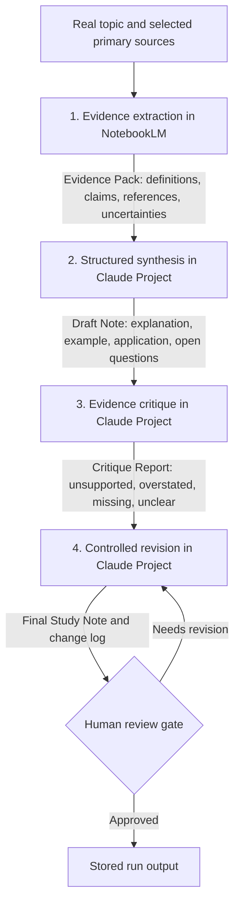

# Ship an Automation Workflow v2

## Workflow Goal

Turn a real technical question and a small set of selected primary sources into a concise, source-grounded study note that I can explain in my own words. The workflow supports the FL-01 target task **Learning an Unfamiliar Technical Topic**.

## Step Diagram

## Defined Handoffs

| From | To | Required handoff | Rejection condition |
|---|---|---|---|
| Source selection | Evidence extraction | Topic question and approved source set | A source is not primary, relevant, or accessible in NotebookLM |
| Evidence extraction | Structured synthesis | Evidence Pack following the exact schema | A claim lacks a source reference or uncertainty is hidden |
| Structured synthesis | Evidence critique | Draft Note plus the unchanged Evidence Pack | The draft introduces claims outside the Evidence Pack |
| Evidence critique | Controlled revision | Draft Note, Evidence Pack, and Critique Report | Critique asks for unsupported additions |
| Controlled revision | Human review | Final Study Note and change log | Changes cannot be traced to evidence or critique |

## Tool Allocation

| Tool | Steps | Reason for fit | Trade-off |
|---|---|---|---|
| NotebookLM | Source ingestion and evidence extraction | Keeps the first handoff grounded in a deliberately limited source set and exposes source references | Source ingestion and transfer to Claude are manual; citation markers still require human checking |
| Claude Project | Synthesis, critique, and controlled revision | Reuses stable instructions and output schemas across five topics | The writer and critic use the same model family, so critique is not independent verification |

## Human Review Gates

Human judgment is required to approve the source set, verify sampled claims against the original sources, reject unsupported critique suggestions, and confirm that the final note can be explained without reading it aloud.

## Five Real Runs

| Run | Topic | Status | Manual baseline | Workflow time | Human review | Output |
|---:|---|---|---:|---:|---|---|
| 01 | Workflow vs agent | Complete | 35 min | 3m 23.75s model execution; handoff/review not timed | Approved after correction | [run-01](runs/run-01-workflow-vs-agent.md) |
| 02 | MCP tools, resources, and prompts | Complete | Not repeated | NotebookLM: 36.91s; Claude not timed | Approved | [run-02](runs/run-02-mcp-primitives.md) |
| 03 | Human approval gates | Complete | Not repeated | NotebookLM: 29.07s; Claude not timed | Approved | [run-03](runs/run-03-human-approval-gates.md) |
| 04 | Agent evaluation design | Complete | Not repeated | NotebookLM: 24.82s; Claude not timed | Approved | [run-04](runs/run-04-agent-evaluation.md) |
| 05 | Context engineering for tool-using systems | Complete | Not repeated | NotebookLM: 23.65s; Claude not timed | Approved | [run-05](runs/run-05-context-engineering.md) |

## Timing Method

Setup time starts when the first NotebookLM notebook and Claude Project configuration are created and ends when the first test-ready workflow exists. Each workflow run includes source ingestion, all four steps, manual handoffs, human review, corrections, and file storage. One manual baseline is completed for Run 01 before its workflow execution, using the same topic, source set, target structure, and quality bar. This order may make the later workflow review faster because the topic is no longer unfamiliar, so that limitation must be stated. Reading time that is necessary for comprehension is not excluded merely because it reduces the apparent saving.

## Timing Results

| Measure | Time |
|---|---:|
| One-time setup | Not measured |
| Manual baseline | 35 minutes: 15 minutes reading and 20 minutes writing |
| Run 01 measured model execution | 3 minutes 23.75 seconds |
| NotebookLM execution across five runs | 3 minutes 20.45 seconds |
| Claude execution across five runs | Only Run 01 measured: 1 minute 57.75 seconds |
| Run 01 execution-only difference | 31 minutes 36.25 seconds, or 90.3% less than the manual baseline |
| Five-run end-to-end time | Not measured |
| Net saving after setup | Not defensibly calculable |
| Break-even point | Not defensibly calculable |

The 90.3% figure is an execution-only estimate, not a claim about total time saved. It excludes manual source setup, copy-and-paste handoffs, file storage, correction, and human review. The manual baseline also came first, so prior familiarity may have made the later review faster. Because setup and complete workflow durations were not timed, no honest net-saving or break-even claim can be made from these runs.

## Known Failure Points

- NotebookLM displayed clickable numbered citations, but copying the response removed them and left blank `Source:` fields. The downstream handoff therefore needs either manual citation repair or a changed export method.
- The same citation-export failure occurred in all five NotebookLM runs, showing that it is reproducible rather than a one-off Run 01 error.
- The Run 01 manual baseline is retained, but its internal `~20 min` labels are informal estimates; the measured comparison time is 35 minutes total.
- Run 01 measured 3 minutes 23.75 seconds of model execution: 1 minute 26 seconds in NotebookLM and 1 minute 57.75 seconds across the three Claude stages. Manual handoff, storage, and human review were not timed, so this cannot be presented as the total automated-workflow duration.
- The writer and critic ran inside the same Claude Project. The critique caught real overstatement, but it is not independent model or source verification.
- Repeating the controlled-revision prompt on unchanged inputs triggered a duplicate-stage warning. Reusing the existing artifact avoided untracked wording drift.
- The workflow is manually orchestrated. It reduces repeated prompt design, but it does not automatically move data between NotebookLM and Claude.

## Cost

No per-run charge was recorded during the five executions. The account tiers and subscription costs were not verified, so this walkthrough does not claim that the workflow is free. The reproducible cost is therefore recorded as **unknown**, not zero.

## Evidence and Screenshots

- [Claude Project configuration](screenshots/claude-project-configuration.png)
- [Run 01 NotebookLM evidence extraction](screenshots/run-01-notebooklm-evidence-pack.png)
- [Run 02 NotebookLM evidence extraction](screenshots/run-02-notebooklm-evidence-pack.png)
- [Run 03 NotebookLM evidence extraction](screenshots/run-03-notebooklm-evidence-pack.png)
- [Run 04 NotebookLM evidence extraction](screenshots/run-04-notebooklm-evidence-pack.png)
- [Run 05 NotebookLM evidence extraction](screenshots/run-05-notebooklm-evidence-pack.png)
- [Shared Claude conversation for Run 05](https://claude.ai/share/947bca7c-344e-4c16-9b19-dffe332a3882)

## Classification for the Next Assignment

Run 01 supports classifying this pipeline as a **workflow**, not an agent. Its NotebookLM → Evidence Pack → Draft Note → Critique → Revision path is fixed in advance. Each transition is initiated by the human; neither model chooses the next stage, changes the route, or decides when the work is complete. The implementation combines prompt chaining with an evaluator-optimizer stage. It is manually orchestrated rather than encoded as an automated code path, but control still does not move to the model.
