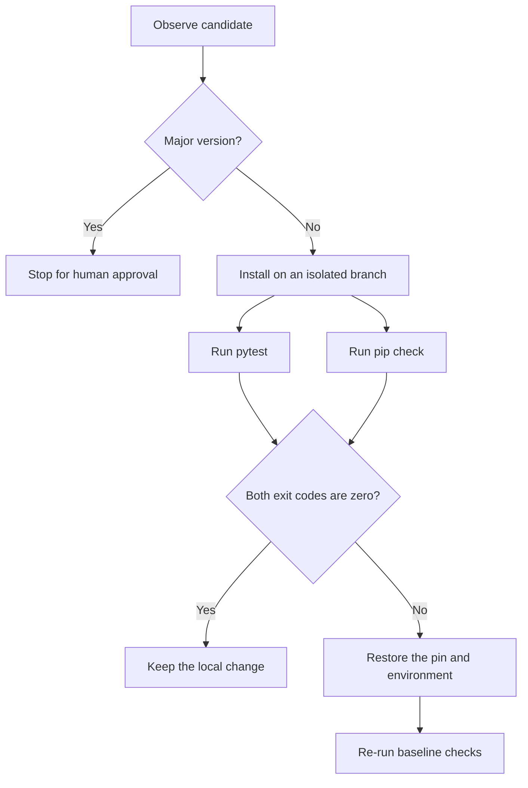

# Explain It Like You Built It: SafeBump's Decision Layer

## The Part I Chose

I chose the decision layer from SafeBump because it is the point where the project stopped being a fixed upgrade workflow and began changing its next action from observed evidence.

SafeBump maintains pinned Python dependencies for one controlled project. It can inspect available releases, install an eligible candidate on an isolated Git branch, run the target's tests, inspect dependency metadata, and either keep or undo the change. The decision layer connects those tools. It turns their outputs into the next action.

## From a Fixed Workflow to a Decision Loop

In SB-07, SafeBump followed one sequence:

```text
create branch → change package → install → test → restore baseline
```

The test result was recorded, but it did not control what happened next. A green test and a red test still led to the same final step. That made SB-07 useful as a repeatable workflow, but it did not yet make a keep-or-rollback decision.

SB-08 added the decision boundary:



The core rule is deliberately small: keep the candidate only when pytest and `pip check` both return exit code `0`. Otherwise, roll it back and record the concrete reason. A major release never reaches the automatic install path.

I use the word “reasoning” carefully here. SafeBump is not asking a language model to make a subjective safety judgment. Its reasoning is a deterministic policy: observed tool results change the control flow. The same inputs produce the same decision, and a reviewer can trace that decision back to exit codes and command output.

## Why I Built It This Way

I considered making the process simpler by using only one verification tool. That would have produced weaker evidence.

Pytest and `pip check` answer different questions. Pytest checks the application behavior represented by the six tests. `pip check` checks whether installed packages declare compatible requirements. Neither can replace the other.

I also rejected an open-ended model decision for the keep-or-rollback boundary. A model could explain the results, but allowing it to reinterpret a failed verification gate would make a safety-sensitive action less predictable. The deterministic rule is easier to test, audit, and defend. Human judgment remains at the irreversible boundaries: major upgrades and remote actions.

## Where the Decision Can Still Fail

A keep decision does not mean “this upgrade is completely safe.” It means only that the checks SafeBump actually ran passed.

The six tests do not cover every runtime path, production traffic, concurrency, performance, or deployment behavior. `pip check` reads dependency metadata; it does not exercise application APIs. An undeclared semantic incompatibility can therefore remain invisible to it. Fresh environments may also resolve different transitive versions because the target pins only its direct dependencies.

SafeBump has been verified only on Ubuntu 26.04 LTS with Python 3.14.4. It does not prove Windows or macOS support, and the MVP does not cover npm, multiple repositories, scheduling, direct transitive upgrades, automatic pull requests, or merge.

## How I Verified the Decision

I used separate cases to challenge each branch instead of showing only a successful upgrade.

| Case | Tool evidence | Decision |
|---|---|---|
| Compatible Uvicorn patch | 6 tests passed; `pip check` clean | Keep locally |
| HTTPX `1.0.dev3` | `pip check` clean; pytest collection failed because `httpx.BaseTransport` was missing | Roll back |
| Controlled Uvicorn conflict | 6 tests passed; real `pip check` conflict | Roll back |
| Vulnerable pytest major release | Security finding present; major boundary crossed | Human approval required |
| Push request without approval | Local result available; no action-specific approval | Do not push |

The two rollback cases were the most important. The HTTPX case showed why clean package metadata cannot prove application compatibility. The controlled Uvicorn conflict showed the reverse: green application tests do not make an inconsistent dependency environment acceptable. After each rollback, SafeBump restored the original pin and reran both baseline checks.

That is the decision layer's real value: it does not claim certainty. It converts limited evidence into a bounded, reversible action and stops where human approval is still required.
