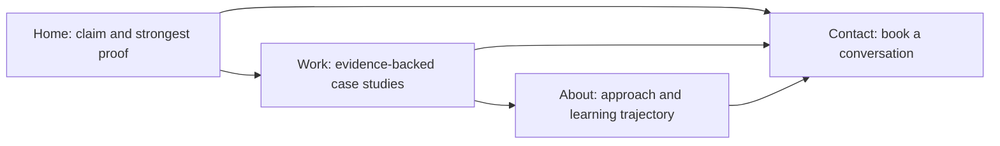

# Portfolio Sitemap

## One Action

Every page should move a technical decision-maker toward one action: **book a conversation**.

## Page Responsibilities

### Home

- State the agent-engineering claim immediately.
- Show PetAdopt as the lead proof.
- Provide a direct route to the Work page and the conversation CTA.

### Work

- Lead with the strongest case study rather than a project grid.
- Show the problem, my decisions, implementation, evidence, limitations, and outcome.
- Include PetAdopt, Foundry Local RAG Assistant, and selected backend engineering work.
- Link to repositories or live demonstrations where public access is appropriate.

### About

- Explain the focused transition toward Backend AI Engineering and agent development.
- Describe my learning approach: plan, build, verify, document, and improve.
- Keep the section short and connect it back to the work.

### Contact

- Offer one primary action: book an online or in-person conversation.
- Provide email and LinkedIn as routes to that same outcome.

## Deliberate Exclusions

- No separate skills page; skills must be demonstrated inside case studies.
- No blog at launch; it does not yet provide stronger proof than the projects.
- No testimonial page until genuine testimonials exist.
- No backend at launch unless a real interaction requires one.
