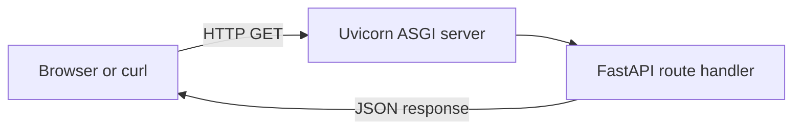

# BE-01 - Build Your First API Endpoint

A minimal FastAPI service that introduces HTTP routing, JSON responses, health checks, and local ASGI development.

[Back to internship portfolio](../../README.md)

## Architecture



The entire application lives in one file so the relationship between a request, route decorator, Python function, and JSON response remains easy to inspect.

## Tech Stack

- Python 3
- FastAPI 0.139
- Uvicorn

## Project Structure

```text
be-01/
├── README.md
└── api-endpoint/
    ├── main.py
    └── requirements.txt
```

## Setup

```bash
cd backend-engineering/be-01/api-endpoint
python -m venv .venv
```

Windows:

```bash
.venv\Scripts\activate
```

macOS or Linux:

```bash
source .venv/bin/activate
```

```bash
pip install -r requirements.txt
```

## Run

```bash
uvicorn main:app --reload
```

The API starts at `http://127.0.0.1:8000`. Interactive documentation is available at `http://127.0.0.1:8000/docs`.

## API Reference

| Method | Path | Purpose | Response |
|---|---|---|---|
| GET | `/` | Greeting | `{"message":"Hello, from FlyRank!"}` |
| GET | `/health` | Service health | `{"status":"ok"}` |
| GET | `/ping` | Liveness check | `{"ping":"pong"}` |

## Try It

```bash
curl -i http://127.0.0.1:8000/
curl -i http://127.0.0.1:8000/health
curl -i http://127.0.0.1:8000/ping
```

## What I Learned

- FastAPI serializes Python dictionaries into JSON responses automatically.
- Decorator-based routing maps URL paths to small Python functions.
- HTTP endpoints are contracts made of a method, path, status code, and response body.
- Uvicorn's reload mode shortens the local edit-test feedback loop.

## Completion Evidence

- Three endpoints return valid JSON.
- The service can be called from both a browser and `curl`.
- Swagger UI discovers all routes automatically.
