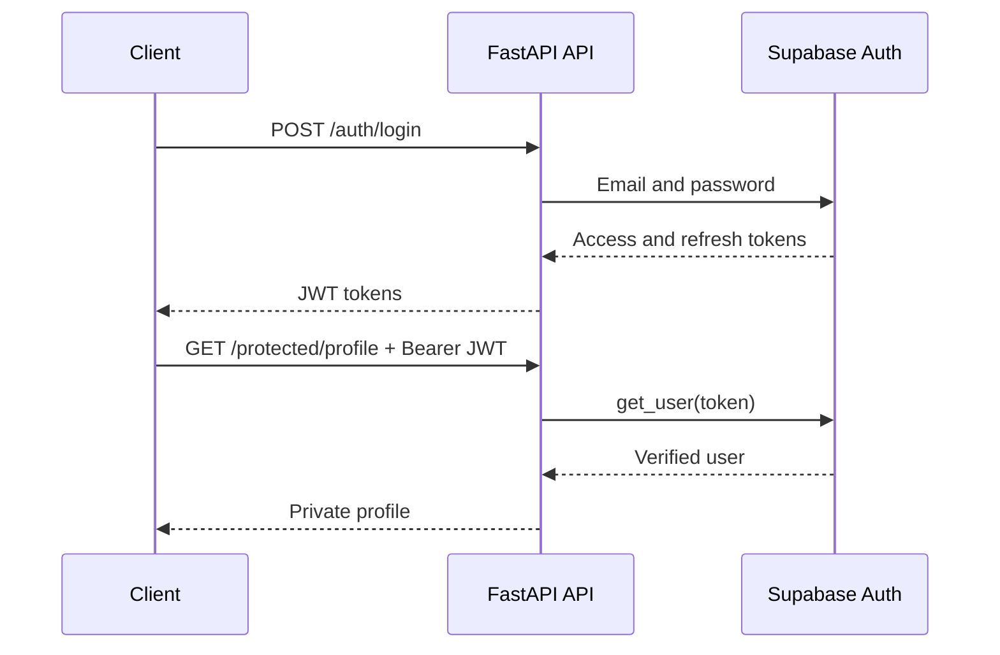
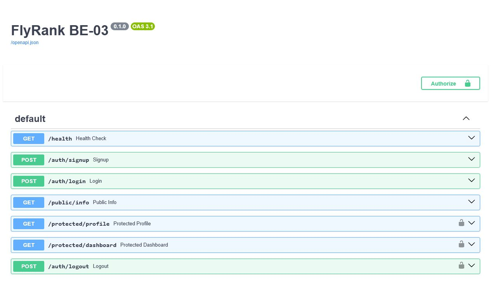

# BE-03 - Auth: Login and Protect

A FastAPI service that delegates account security to Supabase Auth, returns JWT access tokens after login, verifies bearer tokens, and protects selected routes with a reusable dependency.

[Back to internship portfolio](../../README.md)

## Authentication Flow



Supabase stores accounts, hashes passwords, and signs tokens. The API never implements cryptography or stores passwords itself.

## Tech Stack

- Python 3.10+
- FastAPI and Uvicorn
- Supabase Auth and Supabase Python SDK
- JWT bearer authentication with FastAPI `HTTPBearer`
- python-dotenv
- Pytest

## Security Decisions

- Protected requests are trusted only after `supabase.auth.get_user(token)` succeeds.
- Missing, malformed, invalid, altered, and expired tokens produce controlled `401` responses.
- Token validation is centralized in one FastAPI dependency and reused across routes.
- Secrets live in `.env`; only placeholder names are committed in `.env.example`.
- The public anon key is used. A `service_role` key must never be placed in this application.

## Project Structure

```text
be-03/
├── config.py
├── main.py
├── supabase_client.py
├── test_main.py
├── requirements.txt
├── .env.example
└── docs/
    └── swagger-ui.png
```

## Supabase Setup

1. Create a project at [Supabase](https://supabase.com).
2. Copy the project URL and anon key from the project API settings.
3. For this practice project, disable email confirmation in the Email provider settings so a new user can log in immediately. Production applications should normally keep confirmation enabled.
4. Copy `.env.example` to `.env`:

```env
SUPABASE_URL=https://your-project.supabase.co
SUPABASE_KEY=your-anon-key
PORT=8000
```

## Setup and Run

```bash
cd backend-engineering/be-03
python -m venv .venv
```

Windows:

```bash
.venv\Scripts\activate
```

macOS or Linux:

```bash
source .venv/bin/activate
```

```bash
pip install -r requirements.txt
uvicorn main:app --reload
```

The API starts at `http://127.0.0.1:8000`; Swagger UI is at `http://127.0.0.1:8000/docs`.

## API Reference

| Method | Path | Authentication | Success | Errors |
|---|---|---|---:|---:|
| GET | `/health` | None | 200 | - |
| POST | `/auth/signup` | None | 201 | 400 |
| POST | `/auth/login` | None | 200 | 400, 401 |
| POST | `/auth/logout` | Bearer JWT | 204 | 401 |
| GET | `/public/info` | None | 200 | - |
| GET | `/protected/profile` | Bearer JWT | 200 | 401 |
| GET | `/protected/dashboard` | Bearer JWT | 200 | 401 |

The dashboard proves that new protected routes can reuse the same dependency without duplicating auth logic.

## End-to-End Flow

```bash
curl -i -X POST http://127.0.0.1:8000/auth/signup \
  -H "Content-Type: application/json" \
  -d "{\"email\":\"test@example.com\",\"password\":\"password123\"}"

curl -i -X POST http://127.0.0.1:8000/auth/login \
  -H "Content-Type: application/json" \
  -d "{\"email\":\"test@example.com\",\"password\":\"password123\"}"

curl -i http://127.0.0.1:8000/protected/profile \
  -H "Authorization: Bearer YOUR_ACCESS_TOKEN"

curl -i -X POST http://127.0.0.1:8000/auth/logout \
  -H "Authorization: Bearer YOUR_ACCESS_TOKEN"
```

Missing auth returns `{"error":"Access token required"}`. An invalid or expired token returns `{"error":"Invalid or expired token"}`.

## Swagger UI



Click **Authorize**, paste a Supabase access token, and use **Try it out**. Lock icons identify routes that require an `Authorization: Bearer <token>` header.

## Tests

```bash
pytest -q
```

Ten automated tests use a fake Supabase Auth client to cover signup, login, validation, public access, bearer parsing, token verification, two protected routes, logout, and OpenAPI security metadata. Real end-to-end authentication requires your own Supabase project values.

## Logout Note

Supabase revokes refresh tokens when a session is signed out. An already issued access token can remain valid until its short expiry time, which is why access tokens are intentionally short-lived.

## What I Learned

- Authentication answers who the caller is; authorization decides what that caller may do.
- Identity providers remove the need to write password hashing and token signing code.
- Reusable dependencies prevent protected routes from drifting into inconsistent security behavior.
- Swagger security schemes make authenticated API testing visible and repeatable.
